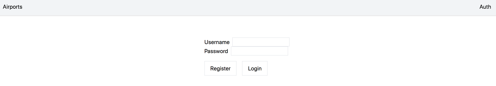

# AirPort finder application

### Test application for employer

___

*Technology stack: React, Redux toolkit, TypeScript*

____

### Functionality:

1. Главная страница. Есть поле поиска Аиропорта по названию (name)
2. Поле фильтров: по типу, стране, региону
   
3. Поле вывода данных, полученых с BACK-а

4. Страницы Авторизации. После прохождения которой, открывается доступ к защищенным данным (Комментарии)
   
5. При клике на конкретный Аэропорт мы попадаем на его страницу, где детально видим все данные, поступающие с BACK-а
   

____

## For star application:
npm start